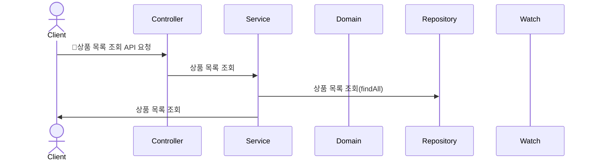
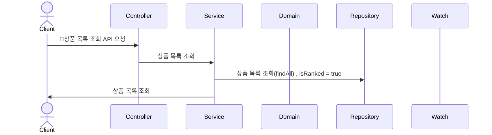

# Sequence Diagram
1. Watch는 로그를 확인할 수 있는 플랫폼으로, Slack으로 가정한다.
2. 비동기 처리는 상황에 따라 MQ를 이용한다. (Kafka)

## 상품 목록 조회하기

## 최근 3일간 가장 많이 팔린 5개의 상품 조회하기
- 인기 상품이라면 가장 노출이 많이 될 확률이 높다.
- 조회가 될 때마다 많이 팔렸는지에 대한 여부를 체크하면 부하가 클 것이다.
- index를 가지는 boolean 컬럼을 작성하고, 1시간 마다 스케줄러를 돌려 갱신해주면 어떨까?

